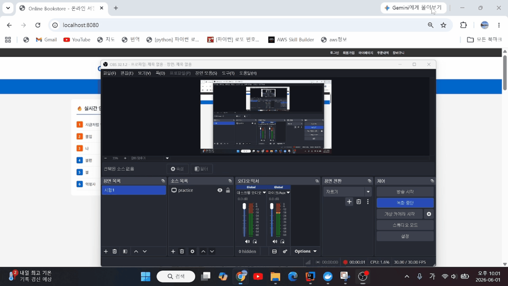
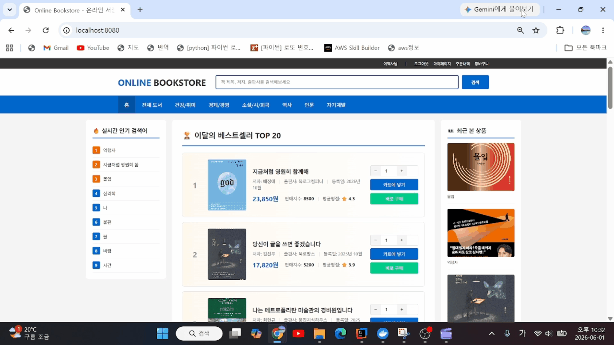
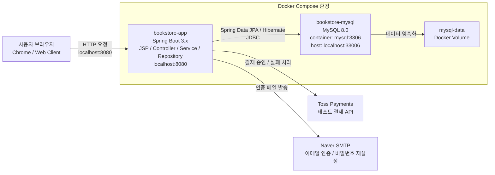
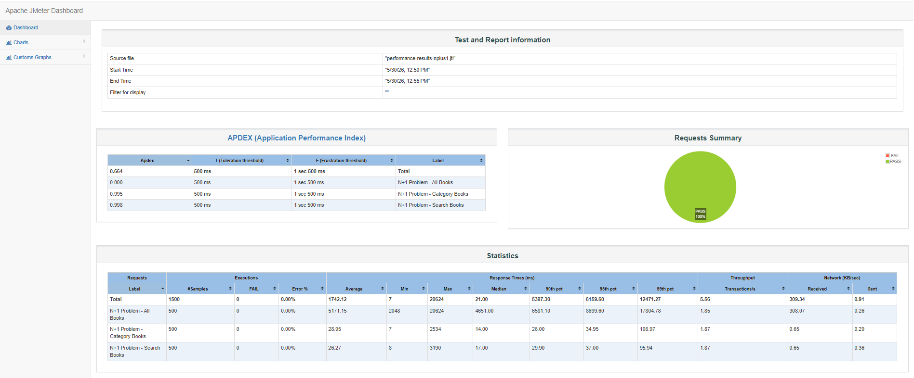
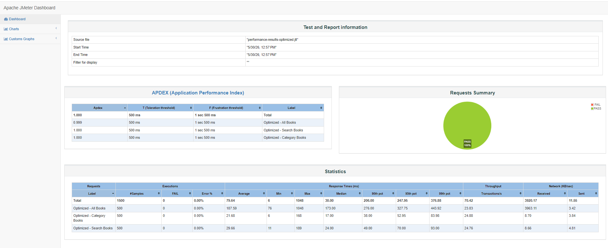
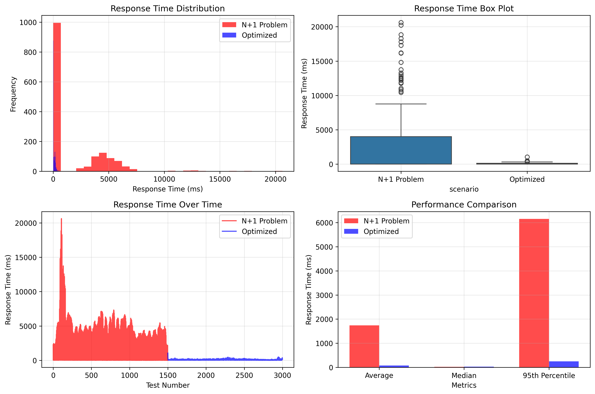

# 온라인 서점 웹 애플리케이션

Spring Boot 기반의 온라인 서점 웹 애플리케이션입니다. Yes24와 같은 대형 서점 플랫폼의 핵심 흐름을 참고하여 **회원 → 도서 탐색 → 장바구니 → 주문/결제 → 리뷰 → 관리자 운영**까지 이어지는 이커머스 라이프사이클을 구현했습니다.

단순 화면 구현을 넘어 주문/결제 상태 관리, 재고 관리, 관리자 백오피스, JPA 성능 최적화 테스트 환경까지 포함한 백엔드 중심의 프로젝트입니다.

## 📌 프로젝트 핵심 요약

### 1. 도메인별 핵심 기능 구성
- **인증 및 회원 관리**
  - Spring Security 기반 로그인/로그아웃 및 일반 회원/관리자 권한 제어
  - 회원가입 이메일 인증, 비밀번호 찾기/재설정
  - 마이페이지 회원 정보 수정 및 배송지 관리

  

- **도서 및 콘텐츠 서비스**
  - 카테고리별 도서 목록, 전체 도서 목록, 검색, 상세 조회
  - 도서-저자 다대다 관계와 카테고리/재고 정보를 포함한 도서 도메인 설계
  - 최근 본 상품, 인기 검색어, 리뷰 및 평점 기능

  

  

- **장바구니 및 주문/결제**
  - 장바구니 담기, 수량 변경, 선택 삭제
  - 장바구니 주문과 바로 구매 주문 처리
  - Toss Payments 테스트 결제 연동 및 결제 성공/실패 처리
  - 주문 상태 관리와 `OrderStatusHistory` 기반 상태 이력 모델 구성

  

- **관리자 백오피스**
  - 매출, 주문, 회원, 도서 현황을 확인하는 대시보드
  - 도서 등록, 목록/상세 조회, 검색/필터링, 재고 수정
  - 회원 목록/상세 조회, 회원별 주문 내역 조회
  - 주문 목록/상세 조회 및 주문 상태 변경

  

### 2. 기술 스택 및 아키텍처 특징
- **Backend**: Java 21, Spring Boot 3.x 기반의 Controller-Service-Repository-Entity 레이어드 아키텍처
- **Database & ORM**: Spring Data JPA, MySQL, Hibernate를 활용한 객체 중심 데이터 모델링
- **도메인 모델링**: `Book`, `Author`, `Category`, `Stock`, `Order`, `Payment`, `Review` 등 이커머스 핵심 엔티티 구성
- **관계 매핑**: 도서-저자 N:M 관계를 `BookAuthor`와 복합키 `BookAuthorId`로 분리해 확장 가능한 구조로 설계
- **Frontend**: JSP, Bootstrap, JavaScript 기반의 서버 사이드 렌더링 화면 구성
- **실행 환경**: Docker Compose로 MySQL과 Spring Boot 애플리케이션을 함께 실행할 수 있도록 구성
- **초기 데이터**: 카테고리, 도서, 저자, 회원, 리뷰, 재고 등 seed SQL을 통한 데이터 초기화 지원

#### 시스템 아키텍처



- Docker Compose 전체 실행 시 `bookstore-app` 컨테이너는 Docker 내부 네트워크에서 `mysql:3306`으로 MySQL에 접속합니다.
- 로컬에서 Spring Boot를 실행하는 경우 애플리케이션은 `localhost:33006`으로 Docker MySQL에 접속합니다.
- 브라우저는 `localhost:8080`으로 Spring Boot 애플리케이션에 접근하고, JSP 기반 화면과 REST API 요청을 처리합니다.

### 3. 차별화 포인트
- JMeter와 Python 분석 스크립트를 활용해 JPA N+1 문제와 Fetch Join 최적화 효과를 정량적으로 검증했습니다.
- `/api/performance/**` 성능 테스트 API를 별도로 구성해 전체 도서, 카테고리, 검색 조회에서 N+1 방식과 최적화 방식을 비교했습니다.
- 약 200권 규모의 전체 도서 조회처럼 반환 데이터량이 많은 API에서는 N+1 문제가 평균 응답 시간을 **5171.15ms**까지 증가시키는 주요 병목으로 작용했고, Fetch Join 최적화 후 **187.59ms**로 감소해 약 **96.4% 개선**을 확인했습니다.
- 반면 카테고리/검색 조회처럼 반환 데이터량이 적은 API에서는 최적화 후 평균 응답 시간이 유사하거나 일부 지표에서는 오히려 증가했습니다. 이를 통해 조회 최적화는 모든 API에 일괄 적용하기보다 데이터 규모, 조회 패턴, 연관 엔티티 접근 빈도에 따라 선택적으로 적용해야 함을 확인했습니다.
- 최적화 버전은 전체적으로 최대 응답 시간과 95%ile 응답 시간을 크게 낮춰, 평균 성능보다 지연 안정성이 중요한 API에서는 유효한 선택지가 될 수 있음을 확인했습니다.
- `MultipleBagFetchException` 등 ORM 이슈와 JSP/JavaScript 연동 문제를 해결하며 기능 구현뿐 아니라 시스템 안정성과 성능까지 함께 검증했습니다.

#### JMeter 성능 비교 결과



`nplus1` : N+1 문제가 발생하는 기존 조회 방식 JMeter 대시보드 

- 전체 도서 조회 평균 시간 : 5171.15ms => 약 200권 전체 조회 시 가장 큰 병목이 발생했습니다.
- 카테고리별 도서 조회 평균 시간 : 28.95ms => 반환 데이터가 적어 평균 응답 시간은 낮게 측정되었습니다.
- 검색 도서 조회 평균 시간 : 26.27ms => 검색 조건으로 조회 범위가 줄어 평균 응답 시간은 낮게 측정되었습니다.
- 전체 처리량 : 5.56 transactions/sec 



`optimized` : Fetch Join을 적용한 최적화 조회 방식 JMeter 대시보드 

- 전체 도서 조회 평균 시간 : 187.59ms => N+1 방식 대비 약 96.4% 개선되었습니다.
- 카테고리별 도서 조회 평균 시간 : 21.68ms => N+1 방식보다 소폭 개선되었습니다.
- 검색 도서 조회 평균 시간 : 29.66ms => N+1 방식보다 평균 시간은 소폭 증가했습니다.
- 전체 처리량 : 70.42 transactions/sec 



## 🚀 애플리케이션 실행 절차

### 1. 사전 요구사항
- **Java 21** 이상
- **Docker Desktop** 및 **Docker Compose** (Docker 실행 시)

Gradle은 프로젝트에 포함된 Wrapper(`gradlew`, `gradlew.bat`)를 사용하므로 별도 설치가 필수는 아닙니다.

### 2. 빠른 실행: Docker Compose로 DB + 앱 실행

프로젝트 루트 디렉토리에서 다음 명령어를 실행합니다.

```bash
docker compose up -d --build
```

Docker Compose는 다음 컨테이너를 실행합니다.

| 컨테이너 | 설명 | 포트 |
|------|------|------|
| `bookstore-mysql` | MySQL 8.0 데이터베이스 | `localhost:33006` -> `mysql:3306` |
| `bookstore-app` | Spring Boot 애플리케이션 | `localhost:8080` |

실행 후 브라우저에서 접속합니다.

- **메인 페이지**: http://localhost:8080
- **관리자 페이지**: http://localhost:8080/admin

로그 확인:

```bash
docker compose logs -f app
```

컨테이너 중지:

```bash
docker compose down
```

DB 데이터까지 초기화하면서 중지:

```bash
docker compose down -v
```

### 3. Docker로 MySQL만 실행하고 로컬에서 앱 실행

앱은 로컬 Gradle로 실행하고, DB만 Docker Compose의 MySQL을 사용하는 방식입니다.

먼저 MySQL 컨테이너를 실행합니다.

```bash
docker compose up -d mysql
```

현재 `src/main/resources/application.yml`의 로컬 DB 설정은 다음 값을 사용합니다.

```yaml
spring:
  datasource:
    url: jdbc:mysql://localhost:33006/bookstore?useSSL=false&allowPublicKeyRetrieval=true&serverTimezone=Asia/Seoul&characterEncoding=UTF-8
    username: bookstore
    password: bookstore123
```

Windows:

```bash
.\gradlew.bat bootRun
```

macOS/Linux:

```bash
./gradlew bootRun
```

실행 후 접속 URL은 Docker Compose 전체 실행 방식과 동일합니다.

- **메인 페이지**: http://localhost:8080
- **관리자 페이지**: http://localhost:8080/admin

### 4. Docker/DB 설정 요약

| 항목 | 값 |
|------|------|
| 애플리케이션 포트 | `8080` |
| Docker MySQL 외부 포트 | `33006` |
| Docker 내부 MySQL 포트 | `3306` |
| DB 이름 | `bookstore` |
| DB 사용자 | `bookstore` |
| DB 비밀번호 | `bookstore123` |
| MySQL root 비밀번호 | `root123` |

Docker Compose 전체 실행 시 앱 컨테이너는 Docker 내부 네트워크의 `mysql:3306`으로 DB에 접속합니다.

```yaml
SPRING_DATASOURCE_URL: jdbc:mysql://mysql:3306/bookstore?useSSL=false&serverTimezone=Asia/Seoul&characterEncoding=UTF-8
```

로컬에서 Gradle로 앱을 실행할 때는 `localhost:33006`으로 DB에 접속합니다.

```yaml
spring.datasource.url: jdbc:mysql://localhost:33006/bookstore?useSSL=false&allowPublicKeyRetrieval=true&serverTimezone=Asia/Seoul&characterEncoding=UTF-8
```

### 5. 자동 초기화 기능

애플리케이션 시작 시 JPA 설정과 초기화 클래스가 자동으로 DB를 준비합니다.

#### 데이터베이스 테이블 생성
- `spring.jpa.hibernate.ddl-auto: update` 설정으로 엔티티 기준 테이블이 자동 생성/갱신됩니다.
- 주요 테이블: Book, Category, Author, Member, Order, OrderItem, Payment, Review 등

#### 초기 데이터 삽입
다음 초기화 클래스가 실행되며 기본 데이터를 삽입합니다.

| 클래스 | 역할 |
|------|------|
| `CategoryInitializer` | 카테고리 데이터 삽입 |
| `BookInitializer` | 저자, 도서, 도서-저자 매핑, 판매량 데이터 삽입 |
| `MemberInitializer` | 테스트 회원 데이터 삽입 |
| `ReviewInitializer` | 리뷰 데이터 삽입 |
| `StockInitializer` | 재고 데이터 삽입 |
| `AdminInitializer` | 기본 관리자 계정 생성 |

## 🔐 관리자 페이지 접속 방법

### 관리자 계정 정보
- **로그인 ID**: `admin`
- **비밀번호**: `admin1234!`
- **역할**: `ADMIN`

### 접속 절차
1. 브라우저에서 `http://localhost:8080/admin` 접속
2. 자동으로 로그인 페이지로 리다이렉트됨
3. 관리자 계정으로 로그인
4. 관리자 대시보드 접근

## 📊 구현 기능 현황

### 일반 사용자 기능
- **인증/회원**
  - 회원가입, 로그인, 로그아웃
  - 아이디/이메일 중복 확인
  - 이메일 인증 코드 발송 및 검증
  - 비밀번호 찾기/재설정
  - 마이페이지 회원 정보 조회/수정
  - 배송지 추가, 수정, 삭제

- **도서 탐색**
  - 메인 페이지 월간 베스트셀러 조회
  - 전체 도서 목록 조회
  - 카테고리별 도서 목록 조회
  - 도서 제목/저자/출판사 검색
  - 페이징 및 페이지 크기 선택
  - 도서 상세 정보 조회
  - 평균 평점, 리뷰 수, 리뷰 목록 표시
  - 인기 검색어 집계 및 최근 본 상품 조회

- **장바구니/주문/결제**
  - 장바구니 담기, 수량 변경, 개별/선택 삭제
  - 장바구니 기반 주문서 작성
  - 바로 구매 주문
  - Toss Payments 테스트 결제 연동
  - 결제 성공 시 주문/주문상품/결제 정보 저장
  - 주문 내역 및 주문 상세 조회
  - 주문 취소

- **리뷰**
  - 주문 상세 화면에서 도서 리뷰 작성
  - 도서 상세 화면에서 리뷰 목록 조회
  - 본인 리뷰 조회 및 삭제

### 관리자 기능
- **대시보드 (`/admin`)**
  - 전체 도서 수, 주문 수, 회원 수, 총 매출 조회
  - 오늘/이번 달 주문 수 및 매출 조회
  - 판매중 도서, 재고 부족 도서, 활성 회원 수 조회
  - 최근 주문, 최근 가입 회원, 재고 부족 도서 활동 표시

- **상품 관리 (`/admin/books`)**
  - 상품 목록 조회, 상세 조회
  - 제목, 출판사, 저자, 카테고리, 판매상태, 재고 범위 검색/필터링
  - 정렬 및 페이징
  - 신규 상품 등록
  - 저자 자동 생성 및 도서-저자 연결
  - 상품별 재고 조회/수정
  - 재고 수량에 따른 판매상태 자동 갱신

- **주문 관리 (`/admin/orders`)**
  - 주문 목록 조회, 상세 조회
  - 회원명/이메일, 주문상태, 상품 판매상태, 날짜 조건 검색/필터링
  - 주문 상품, 배송지, 결제 정보 확인
  - 주문 상태 변경

- **회원 관리 (`/admin/members`)**
  - 회원 목록 조회, 상세 조회
  - 회원 상태, 등급, 가입일 조건 검색/필터링
  - 회원별 주문 내역 조회
  - 회원별 주문 수, 누적 주문 금액, 리뷰 수, 평균 평점, 최근 활동 정보 조회
  - 회원 배송지 정보 확인


## 🚀 성능 최적화 및 트러블슈팅

### JPA N+1 문제 개선
- 도서 목록 조회 시 도서, 저자, 카테고리, 재고 정보를 지연 로딩으로 접근하면서 발생하던 N+1 문제를 분석했습니다.
- `LEFT JOIN FETCH`와 `DISTINCT`를 적용해 연관 데이터를 한 번에 조회하도록 개선했습니다.
- 도서 목록, 카테고리별 조회, 검색 API에 최적화 쿼리를 적용하고 성능 테스트 API로 개선 효과를 검증했습니다.

### 성능 비교 환경 구축
- `/api/performance/**` 엔드포인트를 통해 N+1 발생 방식과 Fetch Join 최적화 방식을 직접 비교할 수 있도록 구성했습니다.
- JMeter 테스트 계획과 Python 분석 스크립트를 작성해 응답 시간, 처리량, 오류율, 개선율을 정량적으로 분석했습니다.
- 전체 도서 조회뿐 아니라 카테고리별 조회, 검색, 관리자 상품/주문/회원 목록 조회까지 비교 범위를 확장했습니다.

### 최적화 과정에서 확인한 트레이드오프
- 데이터 규모와 조회 조건에 따라 Fetch Join 최적화가 항상 유리하지 않을 수 있음을 성능 테스트로 확인했습니다.
- 관리자 화면에서는 모든 데이터를 메모리에서 필터링하는 방식 대신 Repository 레벨의 조건 검색과 페이징을 적용했습니다.
- `MultipleBagFetchException`과 같은 ORM 이슈를 피하기 위해 여러 컬렉션을 무리하게 한 번에 fetch하지 않고, 필요한 연관 관계만 분리해 조회하도록 조정했습니다.
- JSP/JavaScript 화면에서 API 응답을 안정적으로 사용할 수 있도록 DTO 응답 구조를 정리하고 프론트엔드 연동 문제를 함께 해결했습니다.

